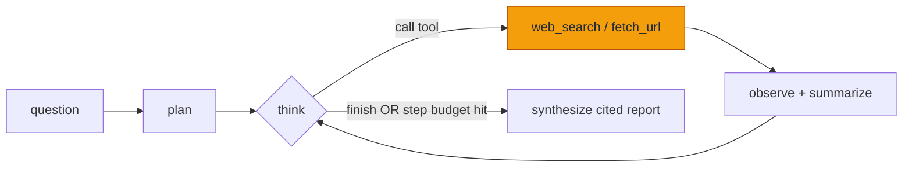
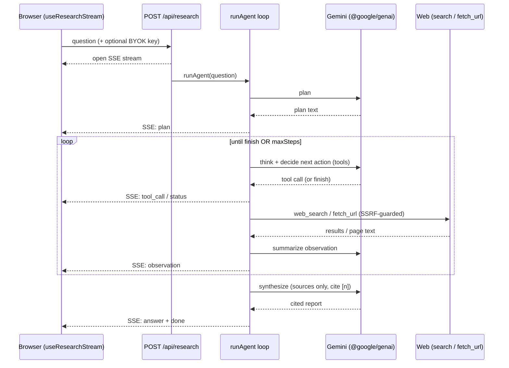

# Scout — an agentic AI research assistant that shows its work

> Ask a hard question and watch an AI **plan, search the live web, read sources,
> and write a cited report — streaming, step by step.** Scout doesn't hand you an
> answer; it shows you the reasoning loop that produced it.

Scout is a from-scratch **AI agent** — a tool-using **ReAct loop** built on
Google **Gemini** with function calling, **SSE** streaming, and source-grounded
synthesis. No agent framework, no black box: the whole point is to make the loop
*legible*. It's a portfolio piece with one thesis:

> **An agent is a `while` loop with a budget and a stop condition — and "decide
> when you're done" is the hard part.**

Keywords for the curious (and the crawlers): agentic AI, LLM agents, ReAct,
tool use / function calling, RAG-adjacent live web retrieval, citations &
grounding, hallucination defense, SSRF hardening, Server-Sent Events, Next.js,
TypeScript, Gemini.

**Live demo:** **https://scout-agentic-researcher.onrender.com** (Render free tier).

Heads up before you click: it's on Render's free tier, so if nobody has visited
in 15 minutes the server spins down and the first load takes 30 to 60 seconds
while it wakes up. Your research runs + chats are saved **on your device**
(IndexedDB) by default, so they survive that restart; **sign in with GitHub** to
sync them across devices (Turso). I decided the cold start was a fair trade for a
free-tier demo.

---

## What it does (and why it's interesting)

Most "AI research" tools give you a confident paragraph and hide where it came
from. Scout inverts that: the **process is the product.** You can watch it think,
see which sources it chose to open, and click any claim back to the page it came
from.

- **Visible ReAct loop.** Each iteration the model either thinks, calls a tool
  (`web_search` / `fetch_url`), or calls `finish`. Every step streams to the UI
  over **Server-Sent Events**, so latency reads as progress, not a spinner.
- **Cited reports, grounded by contract.** The synthesis step may only assert
  facts supported by a fetched source; every claim carries a `[n]` marker that
  links to the source list. A fabricated `[7]` with no source 7 renders as plain
  text — visibly unsupported. Anything it can't ground gets a "Couldn't verify"
  note instead of a confident guess.
- **Step budget + an explicit stop.** The loop is capped (default 8 steps) and
  the model signals completion by *calling* the `finish` tool, not by vibes. If
  the budget runs out first, the report is labelled "stopped early."
- **Context-budget discipline.** Each observation is **summarized before** it
  enters the agent's working memory, so an 8-step run doesn't blow the context
  window with raw pages — full page text lives only in the Sources panel.
- **Free to try, BYOK optional.** Runs go on a shared demo key while it has
  capacity; bring your own free Gemini key (stored only in your browser) for
  unlimited runs. (See [the demo-key model](#the-demo-key--byok-model) below.)
- **Pick your model.** A sidebar picker offers `gemini-3.1-flash-lite` on the
  shared key; the more capable models (2.5-flash, 2.5-flash-lite,
  3-flash-preview, 3.5-flash) unlock once you add your own key. Free-tier quotas
  are tight, so a server-side allowlist gates the heavier models to BYOK runs.
- **"Under the hood" dev panel.** A Beaker toggle X-rays the loop: per-call
  model id, tokens in/out, latency, an **estimated $**, the raw
  `web_search`/`fetch_url` results *before* summarization, and a
  **steps-vs-budget bar**. An agent is a `while` loop with a budget — this makes
  the budget visible. Off by default, opt-in per browser.
- **Light/dark theme.** A toggle flips the theme; an inline script in the layout
  sets it before paint, so there's no flash of the wrong theme on load.

Why it's interesting as a portfolio piece: it's a tool-using agent that
**plans and self-corrects in the open**, with real failure modes handled (runaway
loops, premature finishing, hallucination, SSRF) rather than hand-waved. The
engineering is in the scaffolding around the model, which is exactly where I think
the interesting work in agents actually is.

## Architecture

### The ReAct loop



The amber box is the only place the agent touches the outside world. Everything
else is the model talking to itself through a compact transcript. In code the
core is almost embarrassingly small — the whole project is `src/lib/agent/loop.ts`.

### Request flow (browser → SSE → agent → tools)



### The pieces

- **`src/lib/agent/loop.ts`** — the loop itself: plan → think/act/observe →
  finish → synthesize. Every Gemini call is metered against the demo cap here
  (BYOK calls bypass it).
- **`src/lib/agent/tools.ts`** — three function-calling tools: `web_search`,
  `fetch_url`, `finish`. Deliberately tiny; the point is the loop, not a kitchen
  sink.
- **`src/lib/agent/fetchUrl.ts`** — SSRF-hardened fetcher: http/https only,
  resolves the host and blocks private/loopback/link-local IPs, **follows
  redirects manually and re-validates the host on every hop** (so a 302 or DNS
  rebind can't slip past a one-time check), 8s timeout, 2MB cap, DOMPurify on the
  content.
- **`src/lib/search.ts`** — **Tavily** (primary) → **Google CSE** (fallback) →
  **Wikipedia** (keyless best-effort, so the demo produces real citable sources
  with no search key at all).
- **`src/app/api/research/route.ts`** — POST starts a run and streams steps as
  SSE. The stream is one-directional (server → UI), which is exactly why SSE is
  the honest choice here rather than a WebSocket.
- **`src/lib/db.ts` / `src/app/api/runs/*`** — libSQL (`@libsql/client`) run
  history — a local SQLite file by default, or a durable Turso DB when
  `TURSO_DATABASE_URL` is set — scoped per client session (`x-scout-session`)
  with payload caps and a write rate limit.
- **`src/lib/gemini.ts`** — model + key resolution: the `MODELS` allowlist and a
  server-side `pickModel(requested, byok)` gate that only honors a requested
  model if it's shared-tier *or* the run carries a BYOK key (never trust the
  client), falling back to the default otherwise.
- **`src/lib/devtrace.ts` / `src/components/DevPanel.tsx`** — the "Under the
  hood" telemetry layer. The loop emits additive `model_call` / `tool_exec`
  trace events (model, phase, timing, tokens, raw I/O) that never touch control
  flow; the panel renders them as a call waterfall, per-call cost, and a
  steps-vs-budget bar.

## Stack

- **Next.js 16** (App Router) + **React 19** + **TypeScript** + **Tailwind v4**
- **`@google/genai`** (the current Gemini SDK — better streaming and
  function-calling ergonomics than the legacy `@google/generative-ai` the older
  portfolio apps use). Model default **`gemini-3.1-flash-lite`**, configurable
  via `SCOUT_MODEL` or per-run from the sidebar model picker (heavier models
  BYOK-gated).
- **libSQL / Turso** (`@libsql/client`) for saved runs · **isomorphic-dompurify**
  for sanitizing fetched pages · **react-markdown** + **remark-gfm** for rendering
  reports · **Heroicons** + **lucide-react** for icons.
- **Server-Sent Events** for the agent trace · **Vitest** for tests · **Render**
  (free tier) for deploy.

## Running locally

```bash
npm install
cp .env.example .env.local   # then add your keys (see below)
npm run dev                  # http://localhost:3100
```

Port **3100** is chosen so this runs alongside the other portfolio apps
(net-trailers:3000, gemini-chat-app:5000, echo:3200).

### Environment

```
GEMINI_API_KEY=          # shared demo-key fallback (optional; BYOK preferred)
SCOUT_MODEL=gemini-3.1-flash-lite
TAVILY_API_KEY=          # primary web search (recommended)
GOOGLE_SEARCH_API_KEY=   # fallback search
GOOGLE_SEARCH_ENGINE_ID=
NEXT_PUBLIC_APP_URL=http://localhost:3100
PORT=3100

# Optional: durable saved-run storage. Without these, runs use a local SQLite
# file (ephemeral on Render's free tier). A free Turso DB (turso.tech) persists.
TURSO_DATABASE_URL=
TURSO_AUTH_TOKEN=

# Optional: GitHub sign-in (Auth.js) for cross-device sync. Without these the
# app stays local-first (runs + chats saved on-device via IndexedDB).
AUTH_GITHUB_ID=
AUTH_GITHUB_SECRET=
AUTH_SECRET=
NEXTAUTH_URL=http://localhost:3100
```

**Persistence tiers:** signed out, runs + chats are saved **on your device**
(IndexedDB) — private, survives redeploys, no account. Sign in with GitHub
(optional) to **sync across devices** via Turso, keyed by your GitHub id; on
first sign-in you're offered to import your on-device runs into the account.

With **no search key**, Scout falls back to Wikipedia's keyless search API, so
the demo produces real citable sources out of the box — add a Tavily key for
broader web coverage. The Gemini key lives only in `.env.local` (gitignored) and
is never written to any committed file or log.

### Scripts

```bash
npm run dev          # next dev -p 3100
npm run build        # production build
npm run start        # next start -p 3100
npm run type-check   # tsc --noEmit
npm run lint         # eslint .
npm test             # vitest run (unit tests)
```

## The demo-key / BYOK model

Scout runs on a **shared server demo key** while it has capacity, so you can try
it with zero setup. To keep that key from getting drained (or abused), it's
budgeted by **actual model calls** — one run is roughly 15 calls (plan, several
think/search/read turns, per-page summaries, and synthesis), and the pool is
hard-capped at **250 calls per rolling 24h**, shared with the Echo demo.

That counter is **in-memory / per-process** — it resets on a Render cold start
and isn't shared across instances. A durable, cross-instance cap would live in an
external KV like **Upstash**; I left it out on purpose because for a single
free-tier instance it's unnecessary complexity, and I'd rather call out the
limitation than fake production-grade rate limiting.

**Bring your own key** to bypass the cap entirely: paste a free Gemini API key
into the sidebar and it's stored **only in your browser** and sent per-request —
never persisted server-side. Web-search keys stay server-side only.

## What's hard about this (the honest section)

None of this is hard because the model is hard to call. It's hard because a model
in a loop fails in specific, recurring ways, and handling each one is the actual
engineering:

- **Knowing when to stop.** With no step cap the loop *pages the room* —
  re-searching things it already found, never calling `finish`. Too eager and it
  answers from one search snippet it never opened. That eager/cautious knob is a
  control-flow problem you design, not a model setting; the step budget and the
  explicit `finish` tool are how it's tamed.
- **Hallucination.** Even with good sources gathered, a synthesis step will
  happily assert a clean number that's in no source. The defense is structural —
  the synthesis prompt only gets the registered sources, must cite each claim with
  `[n]`, and unregistered citations render as plain text so a fabrication has
  nowhere to point. It's not a cure; it makes lies *visible*, which is most of the
  battle for something a human reads.
- **`fetch_url` is an SSRF footgun.** Letting a model fetch arbitrary URLs
  server-side is, stated plainly, a request-forgery hole — sanitizing the content
  isn't enough, the *request itself* is the risk. Hence the per-hop host
  re-validation, the blocked IP ranges (including `169.254.169.254`), and the
  size/time caps.
- **Cost shape.** One chat message is one model call; one Scout run is ~15. Rate
  limiting has to be sized per-*run*, not per-message — "agentic" is a multiplier
  on every cost line.
- **A Gemini 3 gotcha.** Tool round-trips 400 unless you preserve the
  `thoughtSignature` on the model's `functionCall` parts — you have to collect the
  model's content parts verbatim from the stream rather than reconstructing them.

If you want the long-form versions of these with the war stories attached, the
blog posts below are where they live.

## Deploying to Render

A [`render.yaml`](render.yaml) blueprint is included: a free Node web service
that runs `npm ci && npm run build` (libSQL ships prebuilt binaries — no native
compile) and starts Next on Render's injected `$PORT`. Set `GEMINI_API_KEY` and
the optional search keys as dashboard secrets (`sync: false`). The free tier's
disk is ephemeral, so saved runs reset on redeploy unless you set
`TURSO_DATABASE_URL` for durable storage — see the note up top.

## Writing about it

Three posts, in increasing altitude:

- [**Agents are a while-loop**](docs/blog/agents-are-a-while-loop.md) — the build
  log. Runaway iteration, quitting too early, confident hallucinations, the SSRF
  guard, and why SSE over WebSockets. Includes a mermaid diagram of the loop.
- [**Lessons from Scout, and where agents are going**](docs/blog/lessons-and-where-agents-are-going.md)
  — the reflection. Why the tools are the product, every tool is an attack
  surface, and grounding is the whole game.
- [**The state of AI agents**](docs/blog/the-state-of-ai-agents.md) — the
  analysis. A sourced 2025–2026 market read (adoption vs. production, who's
  building frameworks, MCP/A2A), the reliability math that governs all of it, and
  a labelled "my take as an engineer" section. Includes market/landscape mermaid
  charts.

---

_Portfolio project by Nathan Watkins. Part of a set: net-trailers (orange),
gemini-chat-app (blue), Scout (violet), Echo (cyan)._
