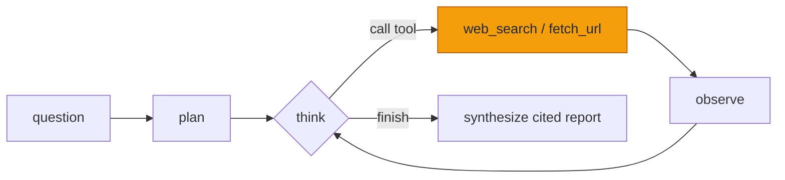

# Agents are a while-loop (the hard part is knowing when to stop)

Everyone says "AI agent" like it's a category of magic. I built one and found a
`for` loop with a step budget and trust issues. That's not a dunk — the loop is
genuinely the interesting part. But the word "agent" had been doing a lot of
mythological heavy lifting in my head, and writing the thing dissolved most of
it. Here's what was actually under there.

This is the build log for **Scout**, a research assistant that takes a question,
searches the web, reads sources, and writes a cited report — while showing you
every step. The whole project exists to make one idea concrete, so let me just
say the idea.

## The one idea you need

An agent is a model in a loop with tools. Each turn, you ask the model "what's
your next move?" and hand it a few tools it can call. It either calls one, or it
says it's done. You run the tool, feed the result back, and ask again.



The amber boxes are the tools — the only place the agent touches the outside
world. Everything else is the model talking to itself through a transcript. In
code it's almost embarrassingly small:

```ts
for (let i = 0; i < maxSteps; i++) {
  const decision = await model.generateContent({ contents, tools });
  const call = decision.functionCalls?.[0];
  if (!call || call.name === 'finish') break;   // ← the whole ballgame
  const observation = await dispatchTool(call);
  transcript.push({ call, observation });
}
const report = await synthesize(question, transcript);
```

That `break` line is where all the difficulty lives. Everything else is
plumbing. The rest of this post is four ways that line went wrong.

## It worked, then it looped 40 times

The first version had no step cap. I asked it a real question and it searched,
read, searched again, read again, and then kept going — re-searching things it
had already found, fetching the same Wikipedia page from a slightly different
anchor, narrowing a query that was already fine. It was the model's equivalent
of pacing the room. It never called `finish` because nothing forced it to
decide it was done.

Two fixes, and you need both:

1. **A hard step budget.** `maxSteps = 8`. When you hit it, you stop looping and
   synthesize from whatever you've got, labelled "stopped early." This is the
   seatbelt — it doesn't make the agent good, it makes it bounded.
2. **An explicit `finish` tool.** The model ends the loop by *calling* `finish`,
   not by emitting prose that I then have to guess the intent of. "Are we done?"
   becomes a structured decision the model makes on purpose, every turn.

"Deciding when you're done" is a real design problem, not a freebie you get with
the word "agent." The step cap is the cheap insurance; the `finish` tool is the
actual mechanic.

## Then it quit too early

So I leaned on `finish`… and the lite model started calling it immediately. One
search, a glance at the snippets, `finish`. The report would be a confident
paragraph built on a search-results preview it never actually opened.

The opposite failure, and the fix is mostly prompt and model:

- The system prompt now says, in plain terms, "prefer web_search to *discover*
  sources, then fetch_url to *read* the promising ones — don't answer from
  snippets." Naming the two-phase rhythm helped a lot.
- I made the model configurable (`SCOUT_MODEL`) and noted in the code that the
  *lite* model is the first dial to turn when the loop misbehaves. Lite models
  are cheap and fast and will happily skip the reading step. A stronger Flash
  for the decide/synthesize calls is the difference between "agent" and "thing
  that pattern-matches a vibe."

Runaway and quit-too-early are the same knob from opposite ends. Tuning that
knob *is* the work.

## It confidently made things up

Even with good sources gathered, the synthesis step would occasionally assert a
clean number that wasn't in any source. Not maliciously — it's a language model,
it knows what a confident sentence sounds like, and it'll produce one whether or
not the fact is in front of it.

The defense is structural, not vibes:

- **The synthesis prompt only gets the registered sources**, each with a number,
  and is told it may only assert what those sources support — and must cite each
  claim with `[n]` using the exact numbers given.
- The UI renders `[n]` as a clickable chip that scrolls to the source. So a
  fabricated claim has nowhere to point. If the model writes `[3]` and there is
  no source 3, the renderer leaves it as plain text — visibly unsupported.
- The prompt explicitly allows a **"Couldn't verify"** note. Giving the model a
  sanctioned way to say "I don't know from these sources" makes it far less
  likely to paper over the gap with a guess.

It's not a hallucination *cure* — nothing is. But it turns hallucinations from
invisible into obvious, which is most of the battle for something a human reads.

There's a quieter safety detail too: `fetch_url` is an SSRF liability if you let
it. Sanitizing the page content isn't enough — the *request itself* is the risk.
So before fetching, Scout resolves the hostname and blocks private, loopback,
and link-local addresses (no `http://169.254.169.254/` cloud-metadata reads),
enforces http/https only, an 8-second timeout, and a 2MB cap. Crucially, a
one-time check isn't enough: a 302 redirect or a DNS rebind can point a
vetted-looking URL at an internal address on the *next* hop. So Scout follows
redirects manually (`redirect: 'manual'`) and re-validates the host on every
hop rather than trusting `fetch`'s automatic following.

## Why SSE, not WebSockets

My other portfolio app (a chat with cross-chat memory) uses WebSockets, and it
should — chat is bidirectional, the client and server both talk constantly.
Scout's stream is different: once you submit a question, **everything flows one
way**, server → UI. Steps, observations, the final report. The client doesn't
say anything back until the next run.

That's the textbook case for **Server-Sent Events**. One HTTP response that
stays open and streams `data:` frames. No upgrade handshake, no socket library,
no heartbeat protocol I have to invent — just a `ReadableStream` from a route
handler and a `fetch` reader on the client. Reaching for a WebSocket here would
be using the fancier tool to look busy. Knowing when *not* to is its own skill,
and SSE is the honest answer for a one-directional stream.

## What it taught me about trusting AI output

The thing I keep coming back to: the agent isn't smart, the *loop* is useful.
The model is a fast, fallible next-step proposer. The value comes from the
scaffolding around it — the step budget that stops the pacing, the `finish` tool
that forces a decision, the citation contract that makes lies visible, the SSRF
guard that keeps a tool from being a footgun.

Which is also the answer to "should I trust AI output?" Not the raw output, no.
But output you can *click into* — where every claim points at a source you can
open yourself — is a different thing. Scout's whole personality is that you
don't have to trust it. You can watch it work and check where it got each
sentence. That felt like the only honest way to ship an "AI that does research."

If I kept going: a `calculator` tool so it can do arithmetic deterministically
instead of guessing; a critic pass that re-reads the report against the sources
before showing it; and per-source confidence so "three sources agree" reads
differently from "one blog said so." But the loop would stay the same five
lines. That's the point.

---

_Scout is open source. The loop is `src/lib/agent/loop.ts` if you want to read
the five lines for yourself._
