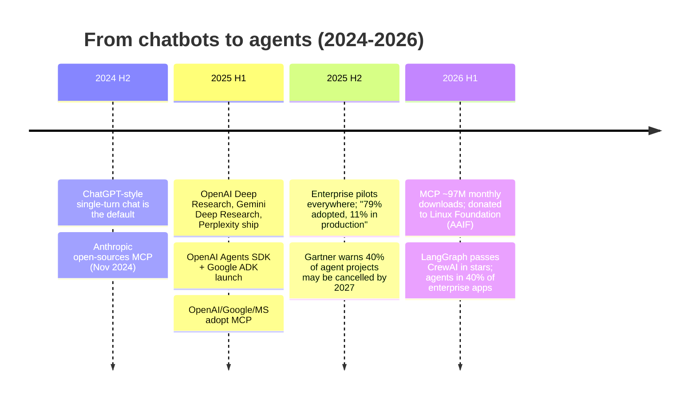
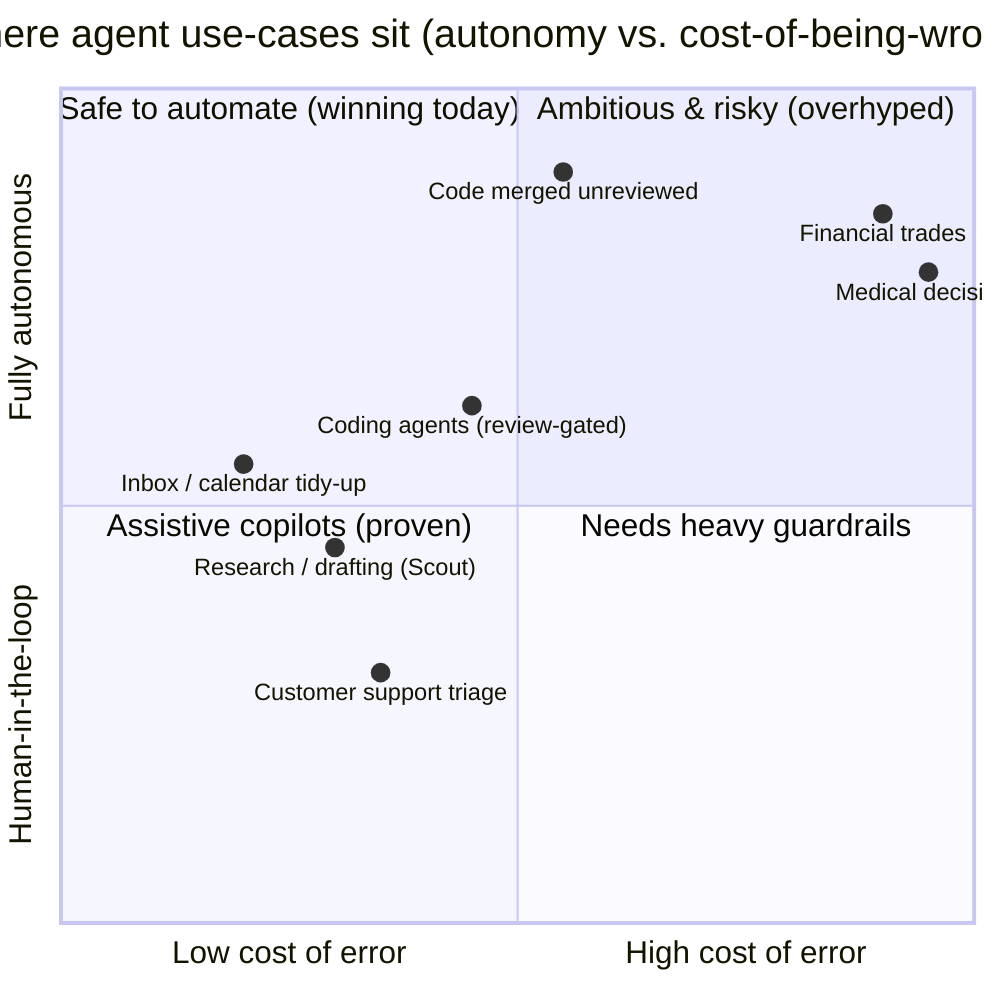

# The state of AI agents — what building Scout taught me, and where this is all going

*This is the analytical companion to the two build posts on **Scout**, my agentic
research assistant. The [war story](./agents-are-a-while-loop.md) is about the
loop going wrong four different ways; the [reflection](./lessons-and-where-agents-are-going.md)
is about the tech choices. This one zooms all the way out: what a small,
hand-built agent actually taught me about the category, an honest read on the
2025–2026 agent market, and where I think the engineering — and the money — is
moving. I've tried to ground the claims in current sources and to hedge the
numbers I'm not sure about rather than launder them into confidence.*

---

## Why a hand-built toy is a good vantage point

Scout is deliberately small: a `while` loop, three tools (`web_search`,
`fetch_url`, `finish`), a step budget of 8, and a synthesis step that's only
allowed to cite sources it actually fetched. No framework, no orchestration
layer, no vector DB. That smallness is exactly why it's a useful lens. When you
strip an agent down to the studs, you can see which parts of the "agentic AI"
story are real engineering and which parts are marketing varnish over a `for`
loop.

The headline lesson, the one that survived contact with every other lesson:
**the model is the cheap part.** The hard, differentiating work is the loop
control, the tool design, the grounding contract, and the guardrails. That's
not a hot take anymore — it's increasingly the consensus read on why so many
agent projects stall, and the data backs it up.

## Three takeaways from building Scout

**1. "Knowing when to stop" is a control-flow problem, not a model problem.**
My first loop had no step cap and it paced the room — re-searching things it had
already found, never calling `finish`. The fix wasn't a smarter model; it was a
hard budget plus an *explicit* stop tool. This maps directly onto a result I
only found after building: agent success rates have a brutal relationship with
task length. Frontier models score near 100% on tasks that take a human under
four minutes, but below ~10% on tasks that take more than four hours
([METR / arXiv 2505.05115](https://arxiv.org/pdf/2505.05115)). Length is the
enemy, and a step budget is the crudest possible acknowledgment of that.

**2. Tool design beats model intelligence, more often than feels fair.** The
single biggest quality jump in Scout came from swapping the keyless fallback
search from DuckDuckGo's Instant Answer API (empty for normal queries) to
Wikipedia's search API (real, citable articles). The model never changed. The
*tool* did. The whole industry rediscovering this is why the **Model Context
Protocol** matters so much (more below) — the tool layer turned out to be where
the leverage is.

**3. Every tool is an attack surface; the model is a confused deputy with your
server's network position.** `fetch_url` is a textbook SSRF hole if you let it —
nudge it toward `http://169.254.169.254/` and it'll read your cloud metadata.
Sanitizing the *content* is the obvious half; constraining the *request* (DNS
resolution, blocking private/loopback/link-local ranges, re-validating every
redirect hop) is the half tutorials skip. As agents get more tools, this becomes
the dominant risk surface, not a footnote.

## The big picture: chatbots became agents

Through 2025 the center of gravity in applied AI shifted from "chat with a model"
to "give a model tools and a loop." The clearest signal is the **Deep Research**
category — which is, structurally, exactly what Scout is, just at scale. OpenAI
shipped Deep Research on Feb 2, 2025, built on an o3-class model with "a new
agentic capability that conducts multi-step research on the internet"
([OpenAI via Aaron Tay's survey](https://aarontay.substack.com/p/the-rise-of-agent-based-deep-research)).
Google's Gemini Deep Research and Perplexity's Deep Research landed in the same
window, all sharing the same skeleton: plan → iteratively search and read →
synthesize a cited report ([ByteByteGo](https://blog.bytebytego.com/p/how-openai-gemini-and-claude-use)).
Building Scout by hand was, more than anything, a way to understand what those
products are doing under the marketing. The answer is reassuringly mundane: a
loop, a few well-designed tools, a grounding step, and a lot of guardrails.

The supporting trend is the rush to standardize the tool layer. Anthropic open-
sourced the **Model Context Protocol** in November 2024; by March 2025 OpenAI had
added MCP support to its Agents SDK, with Google DeepMind and Microsoft following
within months ([Wikipedia: MCP](https://en.wikipedia.org/wiki/Model_Context_Protocol)).
By early 2026 it had effectively won — reported at ~97 million monthly SDK
downloads and 10,000+ public servers, and in December 2025 Anthropic donated it
to a Linux Foundation effort (the Agentic AI Foundation) co-founded with OpenAI
and others ([Pento's year-of-MCP review](https://www.pento.ai/blog/a-year-of-mcp-2025-review)).
I'd treat the precise download figures as directional rather than gospel — they
come from vendor and ecosystem write-ups — but the *direction* is unambiguous:
the industry standardized the thing Scout hard-codes (its three tools) into a
protocol, because bespoke-per-integration tooling doesn't scale.

## Who is building the frameworks

The framework layer consolidated fast. The rough 2026 landscape, from the
comparison write-ups:

- **LangGraph** (LangChain) is the enterprise default for stateful, graph-shaped
  agents that need persistence, audit trails, and human-in-the-loop. It reportedly
  passed CrewAI in GitHub stars in early 2026 and leads on monthly downloads
  ([LangChain](https://www.langchain.com/resources/ai-agent-frameworks),
  [Firecrawl](https://www.firecrawl.dev/blog/best-open-source-agent-frameworks)).
- **CrewAI** owns role-based multi-agent collaboration; it raised ~$18M and claims
  usage across a large share of the Fortune 500 ([Softcery](https://softcery.com/lab/top-14-ai-agent-frameworks-of-2025-a-founders-guide-to-building-smarter-systems)).
- **OpenAI Agents SDK** (Mar 2025) is the OpenAI-native path — strong traction,
  millions of monthly downloads ([Medium roundup](https://medium.com/@atnoforgenai/10-ai-agent-frameworks-you-should-know-in-2026-langgraph-crewai-autogen-more-2e0be4055556)).
- **Google ADK** (Apr 2025) leans on Gemini + Vertex AI and pushed the **A2A
  (Agent-to-Agent)** protocol so agents from *different* frameworks can call each
  other ([Uvik](https://uvik.net/blog/agentic-ai-frameworks/)).

Two protocols are the connective tissue: **MCP** standardizes agent→tool, and
**A2A** standardizes agent→agent. Notably, Scout uses *none* of these. That was a
deliberate teaching choice — a framework would have hidden the exact loop I was
trying to make legible — but it's worth being honest that a production system at
any real scale lives inside this stack, not next to it.

## The market, honestly

The numbers are large and the error bars are larger. Here's my best honest read,
with sourcing, and explicit hedging where the figures disagree.

- **Adoption is real but shallow.** Gartner predicts 40% of enterprise apps will
  feature task-specific AI agents by end of 2026, up from under 5% in 2025
  ([Gartner press release](https://www.gartner.com/en/newsroom/press-releases/2025-08-26-gartner-predicts-40-percent-of-enterprise-apps-will-feature-task-specific-ai-agents-by-2026-up-from-less-than-5-percent-in-2025)).
  But "featured in an app" is not "running in production." One widely-cited stat
  has 79% of enterprises *adopting* agents while only 11% run them in production
  ([Azumo's stats roundup](https://azumo.com/artificial-intelligence/ai-insights/ai-agent-statistics)).
  Treat the exact percentages as soft — they come from different surveys with
  different definitions — but the *gap* between "piloted" and "in production" is
  the most consistent finding across all of them.
- **The money is growing fast on paper.** Multiple trackers put the agent market
  around $7.8B in 2025 growing toward ~$52B by 2030 (CAGR ~46%)
  ([Azumo](https://azumo.com/artificial-intelligence/ai-insights/ai-agent-statistics)).
  I'd file market-sizing CAGRs under "vibes with a decimal point" — they're
  analyst extrapolations, not measurements — but every tracker agrees the slope
  is steep.
- **And a lot of it will fail.** Gartner's most quoted caution: over 40% of
  agentic AI projects could be cancelled by end of 2027 due to unclear value,
  rising costs, and weak governance ([Gartner via Joget](https://joget.com/ai-agent-adoption-in-2026-what-the-analysts-data-shows/)).
  That's the line I trust most, because it matches what I felt building Scout: the
  demo is easy and the *reliable* version is hard.

The quadrant is the whole strategy in one picture. The work that's actually
shipping clusters bottom-left and center: low cost-of-error, human still in the
loop. Scout sits there on purpose — it *gathers and cites*, a human *judges*. The
top-right (fully autonomous, expensive to get wrong) is where the demos are
dazzling and the production deployments are rare, for good reason.

## The reliability wall (the part nobody puts on a slide)

Here's the math that quietly governs all of it. Agent reliability is multiplicative
across steps — the old aerospace "Lusser's law." If each step is 95% reliable, a
10-step task succeeds ~59% of the time; at 90% per step, ~35%; at 85%, ~20%
([Towards Data Science](https://towardsdatascience.com/the-math-thats-killing-your-ai-agent/)).
Worse, errors *self-condition*: once a model's context window contains its own
earlier mistakes, it gets measurably more likely to make more, a finding from a
2025 paper on diminishing returns referenced in
[arXiv work on agent reliability](https://arxiv.org/pdf/2602.16666). One widely
shared figure pins ~88% of agent projects as never reaching production
([Prodigal](https://www.prodigaltech.com/blog/why-most-ai-agents-fail-in-production));
I can't independently verify that one and I'd hold it loosely, but it rhymes with
the Gartner cancellation forecast and with my own experience.

This is *exactly* why Scout's step budget is 8 and not 80. Every step you add is
another factor in a shrinking product. The instinct to give an agent "more
autonomy and more steps" makes the impressive demo and the unreliable product at
the same time. Short loops, hard stops, and human checkpoints aren't timidity —
they're the only thing that survives the multiplication.

## My take as an engineer

A few opinions I'll actually defend, formed by building the thing rather than
reading about it:

- **The agent isn't smart; the loop is useful.** The model is a fast, fallible
  next-step proposer. All the value lives in the scaffolding — the budget that
  stops the pacing, the `finish` tool that forces a decision, the citation
  contract that makes lies visible, the SSRF guard that keeps a tool from being a
  footgun. If your "agent" is impressive *only* because the model is, you've built
  a demo, not a system.

- **Autonomy is a cost center, not a feature.** The market keeps selling "more
  autonomous" as "more advanced." The reliability math says the opposite: every
  step of autonomy you add multiplies your failure probability and your token
  bill. The winning products in 2026 are the ones with the *humility* to keep a
  human at the decision point — which, conveniently, is also where the regulatory
  and trust pressure points. I'd bet on bounded, supervisable agents over
  autonomous ones for anything that matters, for years.

- **Grounding is the moat, not the model.** A cited answer and a confident
  fabrication are byte-for-byte indistinguishable until you force the citations.
  The thing that makes an agent's output worth generating is that you can *click
  into* it. As frontier models commoditize, "can you trust and verify this output"
  beats "is this output marginally smarter" as the thing users actually pay for.

- **The job shift is toward supervision, not replacement — for now.** The
  realistic near-term shape of research-style agents isn't "the AI does the
  research." It's "the AI does the gathering and you do the judging." That's not a
  hedge to be polite; it's what the reliability numbers force. The new roles
  cluster in the boring layers — tool protocols, sandboxing, and *evaluation* of
  whether an agent's output is actually trustworthy. Eval is the unglamorous
  discipline that I think ends up mattering most.

- **The cancellation wave is healthy.** "40% of agent projects cancelled by 2027"
  reads like a doom stat. I read it as the hype tax getting paid. The projects
  that die are the ones that mistook a dazzling demo for a reliable system. The
  ones that survive will look a lot like Scout: small tool surface, hard limits,
  visible reasoning, a human who can check the work.

The honest summary is the same line the whole project exists to prove, just
pointed at the industry instead of my code: **an agent is a `while` loop with a
budget and a stop condition, and almost everything that matters — reliability,
trust, cost, safety — is decided by how you write the three lines around the
model, not by the model itself.**

---

*Sources are linked inline above. The two companion posts:
[Agents are a while-loop](./agents-are-a-while-loop.md) (the build log) and
[Lessons from Scout, and where agents are going](./lessons-and-where-agents-are-going.md)
(the reflection). Scout's loop is `src/lib/agent/loop.ts` — it really is about
five lines.*
